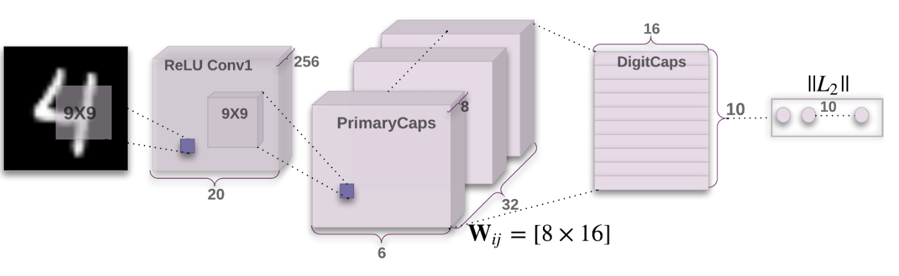
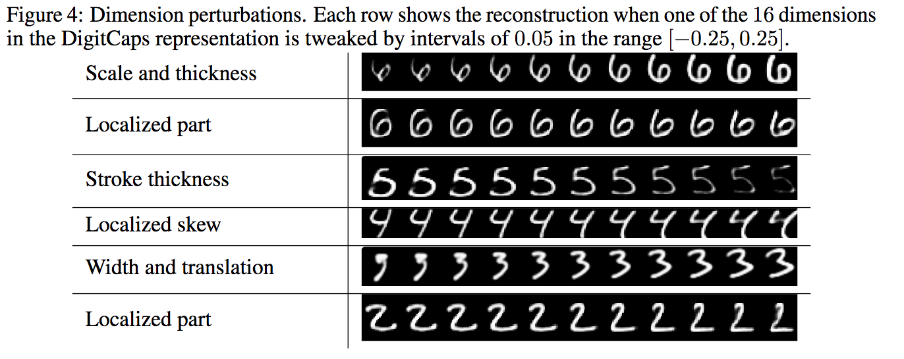
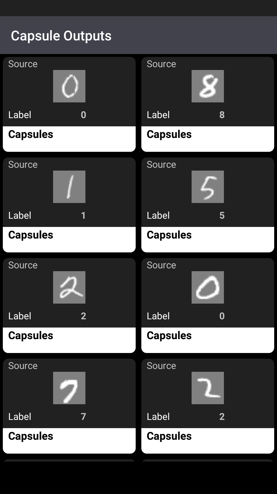
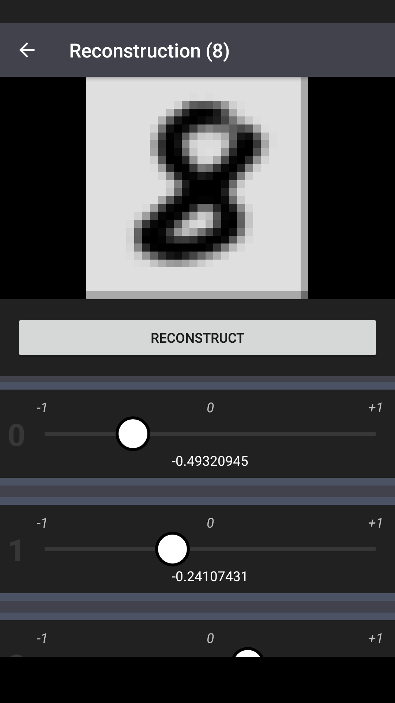
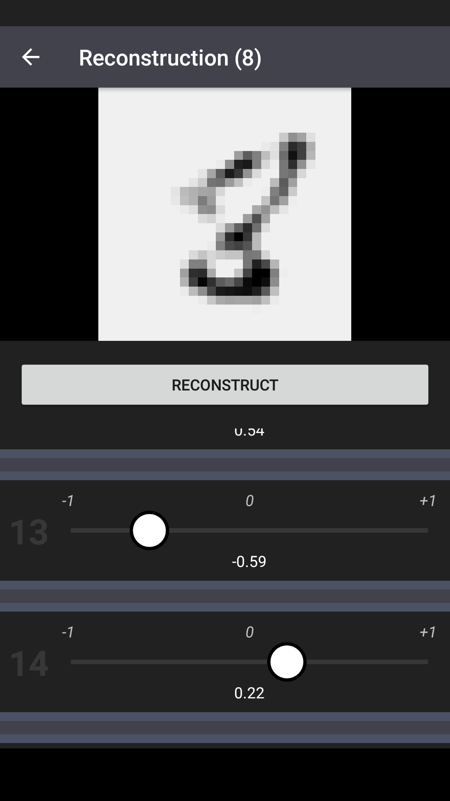
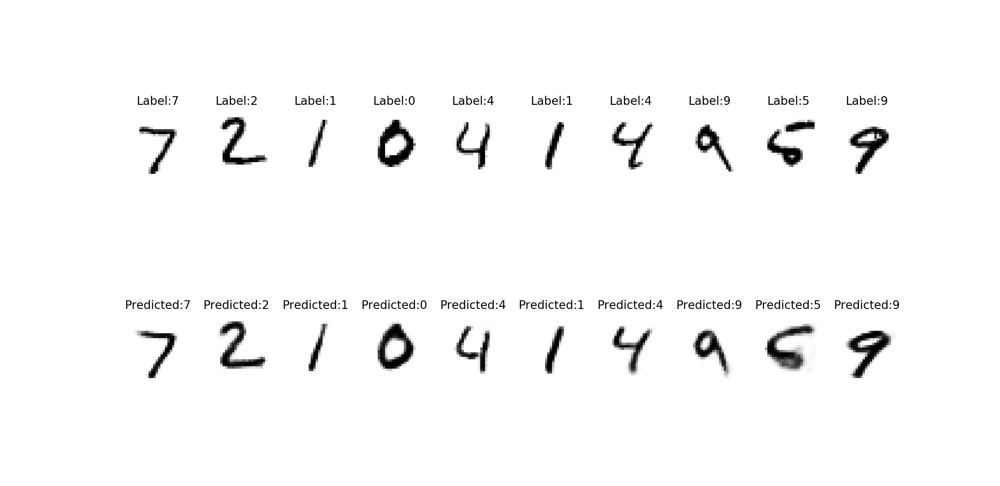

# CapsNetTweak

A Tensorflow implementation of the recently published Capsule Network that allows you to separate/export the `decoder`.

Capsule Network: 

Decoder:    

The `decoder` is found at the end of Capsule Networks and used to recreate the source images. The capsule network is trained taking this **reconstruction loss** into consideration which means that the Capsule Network will learn to give capsules meaningful parameters.

The paper, [*Dynamic Routing Between Capsules*](https://arxiv.org/abs/1710.09829), shows some modification of these Capsule dimensions/parameters.



After exporting the `decoder` (freezing and exporting only the data/graph structure associated with it) I created an Android Application(**./CapsNetTweak**) that can import the model and run inference on the device.

The Android app gives a user the ability to modify or *tweak* any dimension in a Capsule
and run inference on the modified capsule to see the recreation.




Hopefully the modification and recreation of the images will give some insights into what the model learned for each dimension in a Capsule

Goals of the project:
  * Implement and understand a Capsule Network
  * Experience++ with Kotlin and python
  * Sharing a database between python and Kotlin (Android App)
  * Saving models and checkpoints in Tensorflow
  * Separating/Extracting only specific sections of a fully trained model


The new algorithm is described in the recently published papers([*Dynamic Routing Between Capsules*](https://arxiv.org/abs/1710.09829), [*Matrix Capsules with EM Routing*](https://arxiv.org/abs/1710.09829)) by Geoffrey Hinton and team.

## Flow overview
1. Train a model and get a **checkpoint file**
2. Separate and **export** only the **decoder** section of the Capsule Network
3. Use the **decoder** and some **capsules** to reconstruct an image based on the capsules on the Android device

## Getting Started

These instructions should help you train your own model and export the `minimal_decoder` after training.

 *The Android instructions will be in the README found in the CapsNetTweak folder*

### Project overview

* Common/frequent Scripts
  * `train.py` - Train a model and **output** a **checkpoint file**
  * `prediction.py` - Uses a **checkpoint file** to show source images vs prediction images
  * `evaluation.py` - Evaluates a **checkpoint file**: Tests the model against the MNIST validation set
* `caps_net_model/`
  * `model.py` - Creating the full model and exposes different graph operations for different scripts
  * `digit_capsules.py` - Create the digit_capsules
  * `primary_capsules.py` - Create the primary_capsules
  * `decoder.py` - Creates the decoder at the end (3 FC layers)
* `minimal_decoder/`
  * `export_minimal_decoder.py` - Takes the **checkpoint file** and outputs just the minimal_decoder **graph** (.pb file)
  * `minimal_decoder_inference.py` - Runs inference on the exported **graph**
* `CapsNetTweak` - Takes the **graph** exported and imports into an Android App(*more info in subfolder README*)
### Prerequisites

For the python training phase we will need:

* Most of the python scripts depend on

  ```
  from __future__ import division, print_function, unicode_literals
  import numpy
  import tensorflow
  import argparse
  ```
* `export_minimal_decoder.py` depends on
  ```
  import matplotlib.pyplot as plt
  import io
  import scipy.misc
  import sys
  import sqlite3
  ```
## Training

Training will be done with `train.py` which will output a **checkpoint** file.

#### Args
* Required
  * Checkpoint path - Where to save the checkpoints and/or where to look for a checkpoint if you want to continue training an old checkpoint
    * `python train.py --checkpoint_path=./my_checkpoints`
  * Checkpoint Name - What to name the checkpoint
    * `python train.py --checkpoint_path=./my_checkpoints --checkpoint_name=my_awesome_checkpoint`
* Optional
  * Restore Checkpoint - Flag used to restore training from an old checkpoint if applicable (*if there's an old checkpoint*)
    *  `python train.py --checkpoint_path=./my_checkpoints --checkpoint_name=my_awesome_checkpoint --restore_checkpoints=True`
    * Default: True
  *  Training batch size -
    * `python train.py --checkpoint_path=./my_checkpoints --checkpoint_name=my_awesome_checkpoint --batch_size=50`
    * Default: 50
  * Number of epochs -
    * `python train.py --checkpoint_path=./my_checkpoints --checkpoint_name=my_awesome_checkpoint --n_epochs=10`
    * Default: 10


#### Outputs:
After running the training script the output should be a **checkpoint file** in the directory specified.

#### Example
`python train.py --checkpoint_path=./my_checkpoints --checkpoint_name=my_awesome_checkpoint`

**IMPORTANT**
So the path to our checkpoint is `./my_checkpoints/my_awesome_checkpoint` but if you
look in the folder you'll see there's not **a** file with that name.
```
.
└── my_checkpoints
    ├── checkpoint
    ├── my_awesome_checkpoint.data-00000-of-00001
    ├── my_awesome_checkpoint.index
    └── my_awesome_checkpoint.meta

```

Tensorflow exports checkpoints like this and it is used to separate the graph from the actual values but the only thing we need to worry about is that when we are **passing** the **checkpoint file** to the other scripts we need to just reference the model name.

**So don't do this**
```
someScriptThatNeedsCheckpoints --model_path=./my_checkpoints/my_awesome_checkpoint.data-00000-of-00001
someScriptThatNeedsCheckpoints --model_path=./my_checkpoints/my_awesome_checkpoint.index
someScriptThatNeedsCheckpoints --model_path=./my_checkpoints/my_awesome_checkpoint.meta
someScriptThatNeedsCheckpoints --model_path=./my_checkpoints/my_awesome_checkpoint.
```
**Do this**
```
someScriptThatNeedsCheckpoints --model_path=./my_checkpoints/my_awesome_checkpoint
```

## Testing
We can then evaluate the model performance by running `evaluation.py`.
We can also see the **reconstructed** image **vs** the **source images** using `prediction.py`.

Both of these scripts depend on a **checkpoint file** (*trained above using train.py*)
#### Example usage
`python evaluation.py --checkpoint=./my_checkpoints/my_awesome_checkpoint --batch_size=10`

`python prediction.py --checkpoint=./my_checkpoints/my_awesome_checkpoint --batch_size=10`

#### Outputs
`prediction.py` outputs the **generalization error** (*tested against MNIST validation set*): 99.4!

`evaluation.py` outputs an image comparison of the source image and reconstruction



## Extracting the decoder
`export_minimal_decoder.py`

At this point we have a **checkpoint file** and we want to export a **minimal decoder**.

This means that we will recreate a graph for only the `decoder` and freeze *only* the weights that correspond to the decoder. This keeps the graph and data small enough to throw into an Android app.

#### Args
* Required
  * checkpoint - checkpoint file
    * `export_minimal_decoder.py --checkpoint=./my_checkpoints/my_awesome_checkpoint`
* Optional
  * model output - Where to save the model **graph** and **example source and capsules** (database and numpy array files)
    * `export_minimal_decoder.py --checkpoint=./my_checkpoints/my_awesome_checkpoint  --model_output=./model_output`
  * model name -
    * `export_minimal_decoder.py --checkpoint=./my_checkpoints/my_awesome_checkpoint --model_name="my_model_graph.pb"`
  * masked capsules - number of examples to export with the graph
    * `export_minimal_decoder.py --checkpoint=./my_checkpoints/my_awesome_checkpoint --masked_capsules=25`

#### Outputs
`export_minimal_decoder.py` will output a **model graph (.pb)** and a **database** that will be shared with the Android app.

The **database** will have **source images (MNIST Images)** as well as the **capsules** produced by the full Capsule Network.
```
.
├── database
│   └── minimal_decoder.db
├── masked_capsules
│   └── masked_output.npy
├── model_graph.pb
└── source_images
    └── source_images.npy

```
